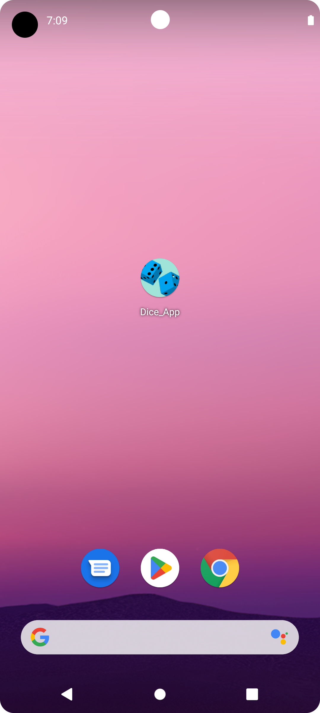
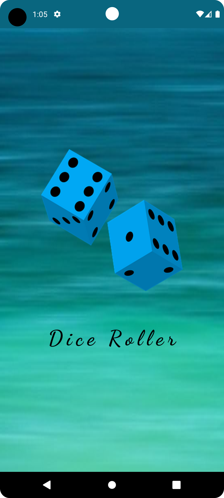
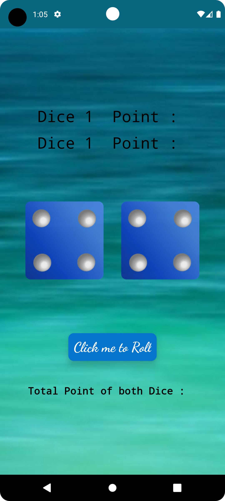
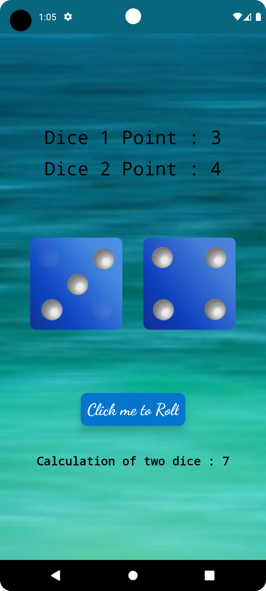
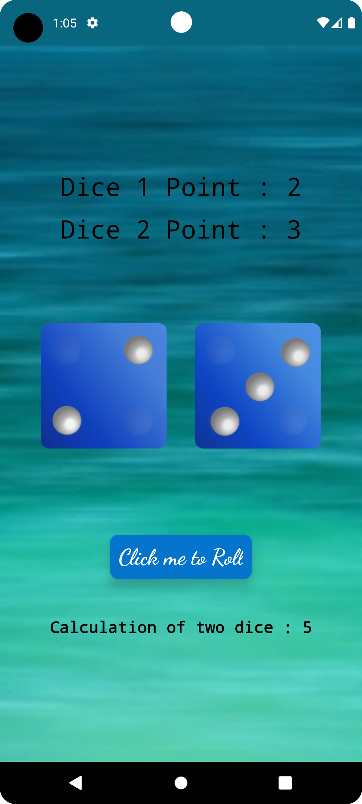
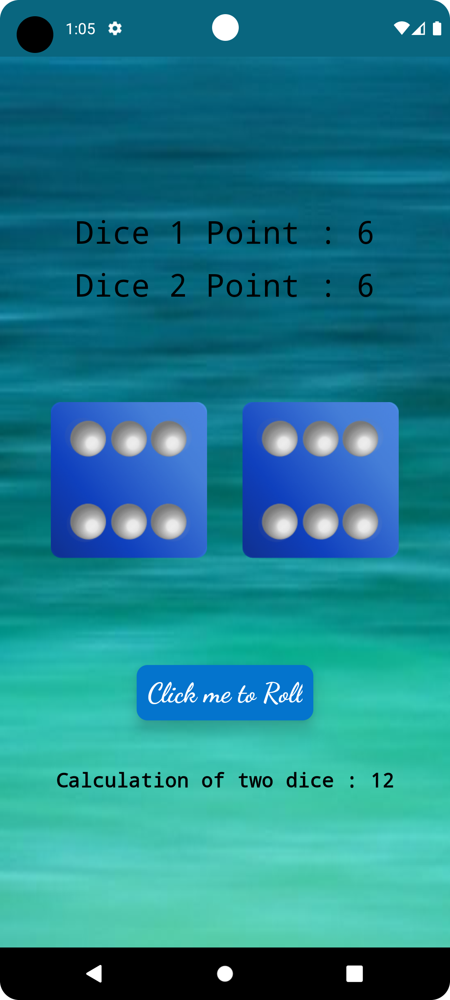

# Dice_App

This engaging Android app offers a virtual dice rolling experience. The user interface is designed with a visually appealing layout that includes two dice images, along with their respective point values, and a "Roll" button to initiate the dice roll. Upon clicking the button, the app generates random values for two dice, updates their images, and displays the individual point values as well as the combined total. Users can experience the thrill of rolling dice virtually and enjoy the excitement of observing the outcome. With its user-friendly interface and interactive features, this app provides a fun way to simulate a dice game.

## <h1 align=center>Screenshots 📸</h1>

||||
|:----------------------------------------:|:-----------------------------------------:|:-----------------------------------------:|
|  |  |  |
|  |  |  |
|  |    |

<!--## App-Preview
 

  
  

  
